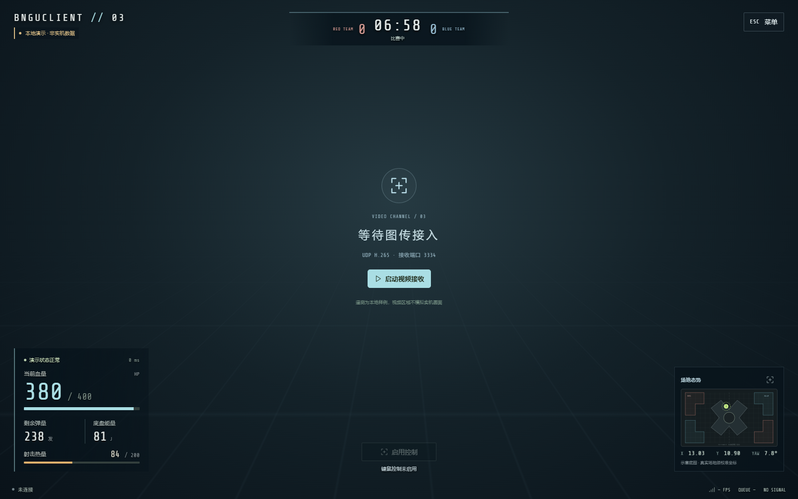

# bnguclient · 裁判链路台架测试版

这是供队友测试裁判系统、超电相关状态和 UDP 图传的独立客户端源码。默认界面是 FPS 风格操作视野：图传占据主画面，关键状态沿边缘显示；按 **Esc** 打开设置、遥测、协议和电控接口菜单。原 HUD 工作台仍可从设置进入。



这份副本以 bnguclient 对照版为界面和协议基础，合入了学习仓库当前的血量有效性改动。它不修改原学习仓库。**这是台架联调版，尚未通过真实裁判服务器、真实超电遥测和比赛设备验收。**

## 队友先看这里

- [下载桌面测试包](https://github.com/afterrain2006/bnguclient-field-test/releases/tag/v1.0.0-field-test.1)：Windows ZIP 和 Linux x86_64 tar.gz；私有仓库需先取得访问权限。
- [使用方法](docs/USAGE.md)：启动、Esc 菜单、连接、图传和控制操作。
- [Linux 安装与验证](docs/LINUX.md)：Ubuntu 依赖、源码运行、打包和目标机检查。
- [裁判系统与超电测试指南](docs/FIELD_TEST.md)：接线前检查、只读测试顺序、记录哪些数据、怎样判定问题所在。
- [测试记录模板](docs/TEST_RECORD.md)：每次实测复制一份填写。

**超电测试范围要分清：**现有标准 MQTT 状态可显示 `RobotDynamicStatus.currentChassisEnergy`（底盘能量）、`currentBufferEnergy`（缓冲能量），`RobotModuleStatus.capacitor` 可显示模块状态；它们都**不是超电容端电压**。所查电控源码中的电容电压在 CAN `0x212`，尚未发现将其转成 `CustomByteBlock` 或 MQTT 发给客户端的实现。电压要上屏，需先由电控与客户端约定并实现发送格式，不能只改 UI。详见 [电控源码核对](docs/reference/FIRMWARE_AUDIT.md)。

## 从源码启动 Windows 桌面版

需要 Node.js、npm、Rust/Cargo 与 Tauri 2 的 Windows 构建依赖（WebView2 等）。在 PowerShell 中：

```powershell
git clone https://github.com/afterrain2006/bnguclient-field-test.git
cd bnguclient-field-test
npm ci
npm run tauri dev
```

浏览器本地演示：`npm run dev:demo`。它会走 Protobuf → Worker → Pinia，但**不经过真实 MQTT/Tauri/UDP**，不能用于判断实机接线。浏览器版也不能建立 MQTT TCP 或 UDP H.265 接收。团队接裁判系统请使用桌面版。

从源码构建桌面可执行文件：

```powershell
npm ci
npm run build
cargo build --release --features tauri/custom-protocol --manifest-path src-tauri/Cargo.toml
.\Start-bnguclient.cmd
```

启动脚本要求当前仓库的 `src-tauri/target/release/bnguclient.exe` 已生成，并以仓库目录为工作目录读取资源。不要只复制 exe 到其他目录后假定资源路径仍可用；给队友分发可执行程序时应先在目标机器验证资源与依赖。

打包独立 Windows 目录与 ZIP：

```powershell
powershell -ExecutionPolicy Bypass -File scripts/package-field-test.ps1
```

ZIP 解压后运行 `run.bat`；它把工作目录切到解压位置，再启动程序。包内含 `bnguclient.exe`、`resources` 和这份测试指南，不需要 Node 或源码。目标机器仍需 WebView2 等 Windows 运行依赖。本机已从独立打包目录验证 Mock MQTT、UDP H.265 和 Esc 菜单；队友机器需再做一次现场检查。

## 从源码启动 Linux 桌面版

以下命令适用于 Ubuntu 22.04 / 24.04 x86_64 的图形桌面。先安装 Tauri 2 构建依赖；另需安装 Rust 稳定工具链与 Node.js 22（见[完整 Linux 指南](docs/LINUX.md)）：

```bash
sudo apt update
sudo apt install -y libwebkit2gtk-4.1-dev build-essential curl wget file \
  libxdo-dev libssl-dev libayatana-appindicator3-dev librsvg2-dev \
  pkg-config git ffmpeg
```

在终端从源码启动：

```bash
git clone https://github.com/afterrain2006/bnguclient-field-test.git
cd bnguclient-field-test
npm ci
npm run tauri dev
```

构建可分发的 Linux 压缩包：

```bash
npm run build:linux
```

产物位于 `build-linux/bnguclient-field-test-linux-x86_64.tar.gz`。也可从上方 Release 直接下载 Linux 包，按[完整 Linux 指南](docs/LINUX.md)安装目标机运行库、解压并执行 `./run.sh`。Ubuntu 22.04 CI 已通过 Linux 编译与打包；图形窗口和实机 MQTT/UDP 仍需在目标机器现场验证。

## 软件自测

```powershell
npm run typecheck
npm run test:reference
npm run verify:mqtt-proto
npm run build
```

本地 Mock：

```powershell
cd tools/rm2026-mock-server
npm ci
npm run dev -- --mqtt-port 1884 --udp-port 3335
```

客户端设置填 MQTT 主机 `127.0.0.1`、端口 `1884`、机器人 ID `3`；UDP 监听端口 `3335`、发送端过滤 `127.0.0.1`。先点击“连接裁判系统”，再点击“启动视频”。Mock 画面和状态只用于软件联调，不代表电控或真实裁判服务器已接通。

2026-09-18 本地检查：TypeScript 类型检查、19 项协议测试、前端构建、浏览器界面检查均通过；独立打包目录内的 Windows release 程序使用本机 Mock 收到 MQTT 状态并解码 UDP H.265（检查时 95 帧），菜单与输入释放检查无页面错误。记录见 `artifacts/browser-check.json` 和 `artifacts/release-check.json`。这些是软件检查，现场裁判与电控仍需按测试指南实测。

源码协议定义在 [`UDP-MQTT Server/proto/messages.proto`](UDP-MQTT%20Server/proto/messages.proto)，自定义字节布局说明见 [设备接口](docs/reference/DEVICE_INTERFACES.md)。先前对照版的测试记录保存在 `docs/reference/VALIDATION.md`，其中的结果不自动等同于本台架测试版的实机结果。
